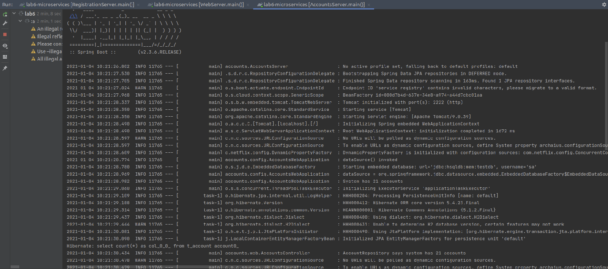
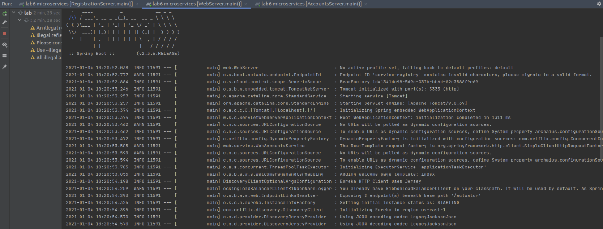
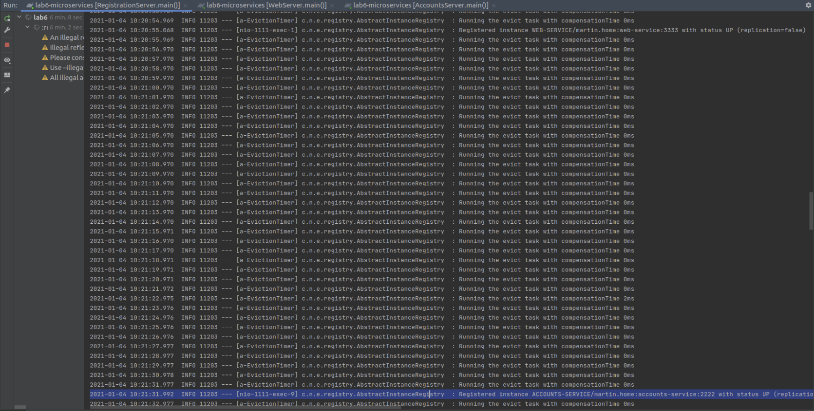
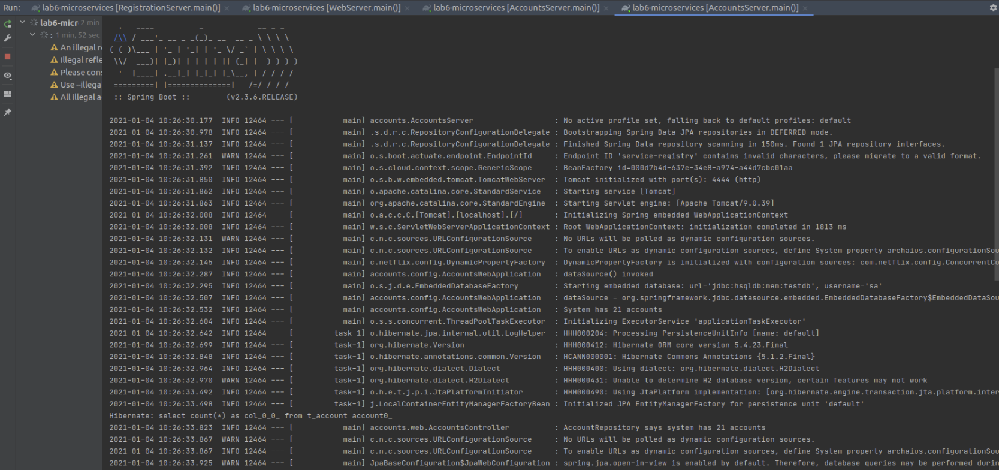
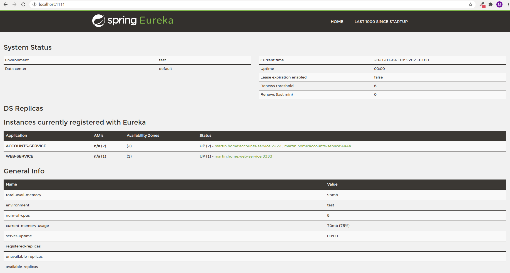
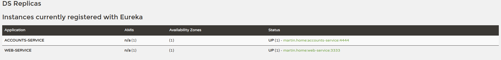

## Lab6 - Microservices

### Accounts service running on port 2222

### Web service running on port 3333

### Eureka server (registration) running on port 1111 with two services registered

### Account microservice running on port 4444

### Dashboard with the two services registered

### What happens when the microservice running on port 2222 is killed? Can the web service provide information about the accounts and why?
Eureka removes the 2222 accounts service

Killing the service has no impact on the user because Eureka redirects to the service hosted on port 4444